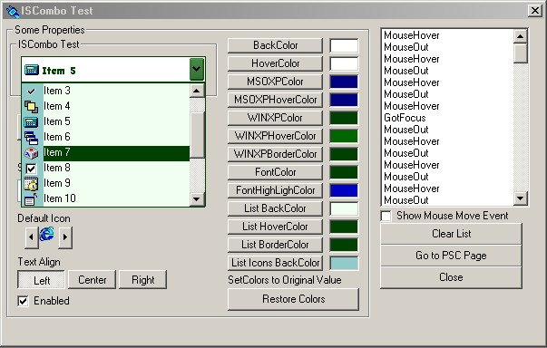



## ISCombo 2\.1 Customizable Styles, colors and Autocomplete

### Description

This update inclides also, Customization for all colors and Autocomplete.

And these Graphic styles

* Normal.

* MSOffice 2000

* MSOffice XP

* Windows XP.

If You liked previous Version You Will Love this one !! Please Leave Comments And Vote !

If you have more suggestions please mailme !
 
### More Info
 

             |
---                |---
**Submitted On**   |2002-06-15 20:13:28
**By**             |[Fred\.cpp](https://github.com/Planet-Source-Code/PSCIndex/blob/master/ByAuthor/fred-cpp.md)
**Level**          |Advanced
**User Rating**    |4.7 (220 globes from 47 users)
**Compatibility**  |VB 6\.0
**Category**       |[Custom Controls/ Forms/  Menus](https://github.com/Planet-Source-Code/PSCIndex/blob/master/ByCategory/custom-controls-forms-menus__1-4.md)
**World**          |[Visual Basic](https://github.com/Planet-Source-Code/PSCIndex/blob/master/ByWorld/visual-basic.md)
**Archive File**   |[ISCombo\_2\_9503461520\.zip](https://github.com/Planet-Source-Code/fred-cpp-iscombo-2-1-customizable-styles-colors-and-autocomplete__1-35565/archive/master.zip)

